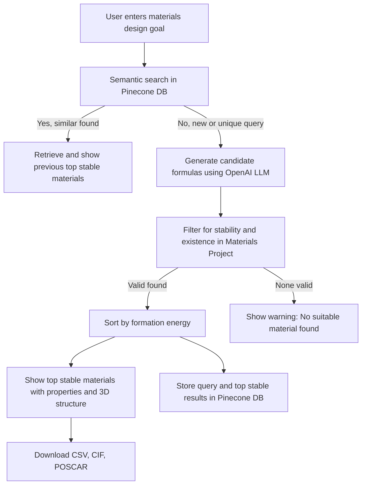

# Materials PredictAI

An AI-powered web application that predicts stable, real-world materials for your design goal, and provides interactive 3D visualizations of their crystal structures and key properties. Built with Streamlit, it integrates OpenAI models and the Materials Project API, making it a powerful tool for materials science research, discovery, and education.

Developed & maintained at IIT (BHU), Varanasi, specifically for material scientists.

## Features


### Core Features

- **AI-Powered Most Stable Material Suggestions:**
   - Enter your materials design goal in natural language. The app uses OpenAI LLMs to suggest candidate formulas, then strictly filters them and try to show the top 3 stable, real-world materials present in the Materials Project database.
- **Strict Materials Project Filtering:**
   - Only materials that are both present and marked as stable in the Materials Project are shown. Non-existent or unstable suggestions are clearly flagged and filtered out.
- **Semantic Search on Past Queries:**
   - Uses vector embeddings and Pinecone to store and retrieve previous queries and their results. If a new query is semantically similar to a past one, the app reuses the previous results for speed and relevance.
- **Interactive 3D Visualization:**
   - Visualize crystal structures in 3D using py3Dmol for enhanced understanding and presentation. Download CIF and POSCAR files for further analysis.
- **Modern, Intuitive Web UI:**
   - Clean, user-friendly interface built with Streamlit. All results, warnings, and suggestions are clearly presented for easy interpretation.
- **Knowledge Base & Vector Search:**
   - Previous queries and their results are stored in a vector database (Pinecone) for fast retrieval and improved user experience on repeated or similar queries.


### How It Works

Below is a visual summary of the Materials PredictAI workflow:



## Getting Started


### Prerequisites

- Python 3.11
- API keys for OpenAI, Pinecone, and Materials Project (see below)

### Installation


#### Option 1: Using Anaconda Navigator (Recommended GUI Method)

1. **Install Anaconda** (if not already installed):
   - Download and install Anaconda from the [official website](https://www.anaconda.com/products/distribution).

2. **Clone the repository:**
   ```bash
   git clone https://github.com/sinhapriyanshu200/materials-predictAI.git
   cd materials-predictAI
   ```

3. **Open Anaconda Navigator.**

4. Go to the **Environments** tab and click **Import**.

5. Browse to select the `matenv.yaml` file.

6. Name the environment (e.g., `matenv`) and click **Import**. Anaconda Navigator will create the environment with all required dependencies.

7. Once the environment is created, you can activate it from the Anaconda Navigator UI, or in the terminal:
   ```bash
   conda activate matenv
   ```

8. Continue to the next steps to add your API keys and run the app.

#### Option 2: Using Python venv and requirements.txt (Alternative CLI Method)

1. **Clone the repository:**
   ```bash
   git clone https://github.com/sinhapriyanshu200/materials-predictAI.git
   cd materials-predictAI
   ```

2. **Create and activate a virtual environment:**
   ```bash
   python3 -m venv venv
   source venv/bin/activate
   ```

3. **Install dependencies:**
   ```bash
   pip install -r requirements.txt
   ```

4. **Add your API keys to a `.env` file:**
   ```

   OPENAI_API_KEY=your_openai_key
   PINECONE_API_KEY=your_pinecone_key
   MATERIALS_PROJECT_API_KEY=your_materials_project_key
   ```


### Running the App

```bash
streamlit run Application.py
```

## License

This project is licensed under the Apache License 2.0. See the [LICENSE](LICENSE) file for details.

## Third-Party APIs


This project uses OpenAI, Pinecone, and Materials Project APIs. Usage of these APIs is subject to their respective terms of service. You must obtain your own API keys and comply with:

- [OpenAI Terms of Service](https://openai.com/policies/terms-of-use)
- [Pinecone Terms of Service](https://www.pinecone.io/terms/)
- [Materials Project Terms of Use](https://materialsproject.org/about/terms)

## .gitignore

A `.gitignore` file is included to prevent sensitive and unnecessary files from being tracked. Make sure your `.env` and other secrets are not committed.

## Citation

If you use this project for research, please cite appropriately.

## Contact

For questions, feedback, or collaboration inquiries, please contact:

priyanshusinha.mst24@itbhu.ac.in

---


**Developed at:**

School of Materials Science and Technology  
Indian Institute of Technology (IIT BHU), Varanasi  
Uttar Pradesh, India-221005
