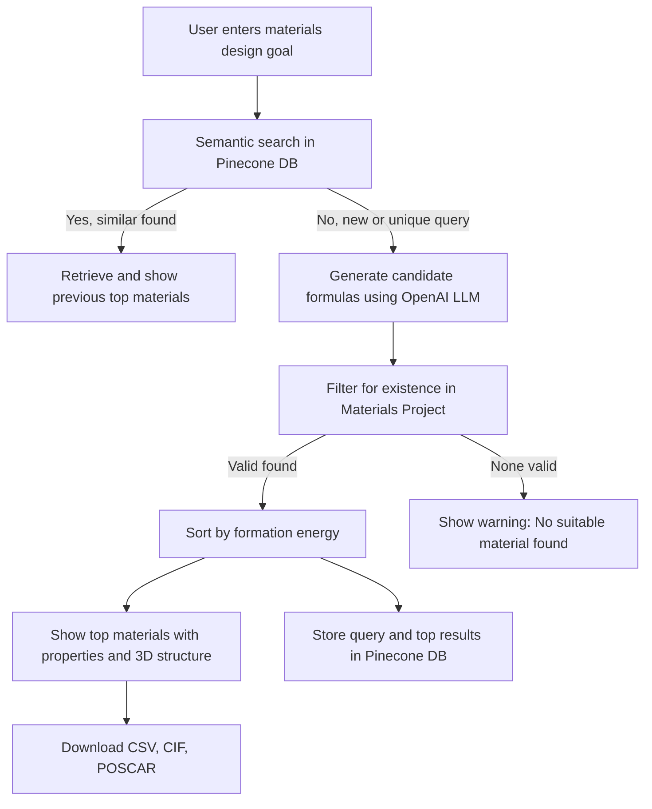

# [🚀 Try Materials PredictAI on Streamlit](https://materials-predictai.streamlit.app)
# Materials PredictAI

Materials PredictAI is an AI-powered web application for materials discovery and research. It predicts the best candidate materials for your design goal, provides interactive 3D visualizations of their crystal structures, and enables easy download of data for further analysis. Built with Streamlit, it integrates OpenAI LLMs, the Materials Project API, and Pinecone vector search for a modern, research-grade experience.

Developed at IIT (BHU), Varanasi for the materials science community.

## Features

- **AI-Powered Material Suggestions:**
   - Enter your materials design goal in natural language. The app uses OpenAI LLMs to suggest candidate chemical formulas, then strictly filters them to show the top 3 materials from the Materials Project database that best match your query. These materials are selected for both high stability and strong compliance with your requirements.
- **Strict Materials Project Filtering:**
      - Only materials available in the Materials Project are shown; unavailable suggestions are flagged and filtered out. If the LLM suggests unstable materials, you can easily include or exclude them using a toggle button.
- **Semantic Search & Knowledge Base:**
  - Uses Pinecone vector embeddings to store and retrieve previous queries and their results. If your query is similar to a past one, the app reuses the previous results for speed and relevance.
- **Interactive 3D Visualization:**
  - Visualize crystal structures in 3D using py3Dmol. Download CIF and POSCAR files for further analysis.
- **Modern, Intuitive Web UI:**
  - Clean, user-friendly interface built with Streamlit. All results, warnings, and suggestions are clearly presented for easy interpretation.
- **Downloadable Results:**
  - Download results as CSV, CIF, or POSCAR files directly from the app.

## How It Works

1. **User enters a materials design goal** (e.g., "Materials for Artificial Bone Development").
2. **Semantic search**: The app checks if a similar query exists in the Pinecone vector database. If found and the query has no new constraints, it reuses the previous results.
3. **LLM suggestion**: If the query is new or has constraints, OpenAI LLM generates a list of candidate formulas.
4. **Materials Project filtering**: Each formula is checked for existence in the Materials Project database. Only valid materials are kept.
5. **Sorting and selection**: Materials are sorted by formation energy (ascending) and the top 3 are shown.
6. **Results display**: Properties and 3D structures are shown. Download links for CSV, CIF, and POSCAR are provided.
7. **Knowledge base update**: New queries and their results are upserted into Pinecone for future semantic search.



> **Note:** The above mermaid flowchart requires a Markdown viewer or platform that supports mermaid diagrams (e.g., GitHub, GitLab, or VS Code with the appropriate extension).

## Getting Started

### Prerequisites

- Python 3.11
- API keys for OpenAI, Pinecone, and Materials Project

### Installation

#### Option 1: Using Anaconda Navigator (Recommended)

1. **Install Anaconda** (if not already installed):
   - Download and install from [Anaconda](https://www.anaconda.com/products/distribution).
2. **Clone the repository:**
   ```bash
   git clone https://github.com/sinhapriyanshu200/materials-predictAI.git
   cd materials-predictAI
   ```
3. **Open Anaconda Navigator** and import the `matenv.yaml` file to create the environment.
4. **Activate the environment:**
   ```bash
   conda activate matenv
   ```
5. **Add your API keys to a `.env` file** in the project directory:
   ```
   OPENAI_API_KEY=your_openai_key
   PINECONE_API_KEY=your_pinecone_key
   MATERIALS_PROJECT_API_KEY=your_materials_project_key
   ```

#### Option 2: Using Python venv and requirements.txt

1. **Clone the repository:**
   ```bash
   git clone https://github.com/sinhapriyanshu200/materials-predictAI.git
   cd materials-predictAI
   ```
2. **Create and activate a virtual environment:**
   ```bash
   python3 -m venv venv
   source venv/bin/activate
   ```
3. **Install dependencies:**
   ```bash
   pip install -r requirements.txt
   ```
4. **Add your API keys to a `.env` file** as above.

### Running the App

```bash
streamlit run Application.py
```

## License

This project is licensed under the Apache License 2.0. See the [LICENSE](LICENSE) file for details.

## Third-Party APIs

This project uses OpenAI, Pinecone, and Materials Project APIs. Usage of these APIs is subject to their respective terms of service. You must obtain your own API keys and comply with:

- [OpenAI Terms of Service](https://openai.com/policies/terms-of-use)
- [Pinecone Terms of Service](https://www.pinecone.io/terms/)
- [Materials Project Terms of Use](https://materialsproject.org/about/terms)

## .gitignore

A `.gitignore` file is included to prevent sensitive and unnecessary files from being tracked. Make sure your `.env` and other secrets are not committed.

## Citation

If you use this project for research, please cite appropriately.

## Contact

For questions, feedback, or collaboration inquiries, please contact:

priyanshusinha.mst24@itbhu.ac.in

---

**Developed at:**

School of Materials Science and Technology  
Indian Institute of Technology (IIT BHU), Varanasi  
Uttar Pradesh, India-221005
